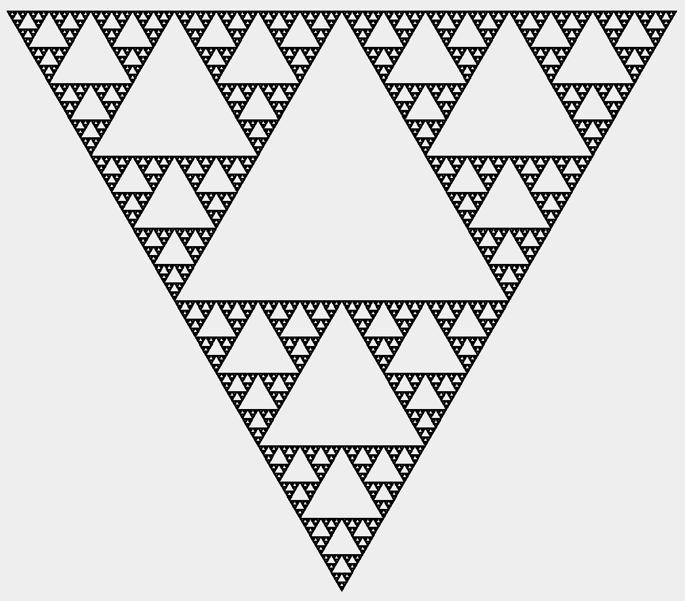
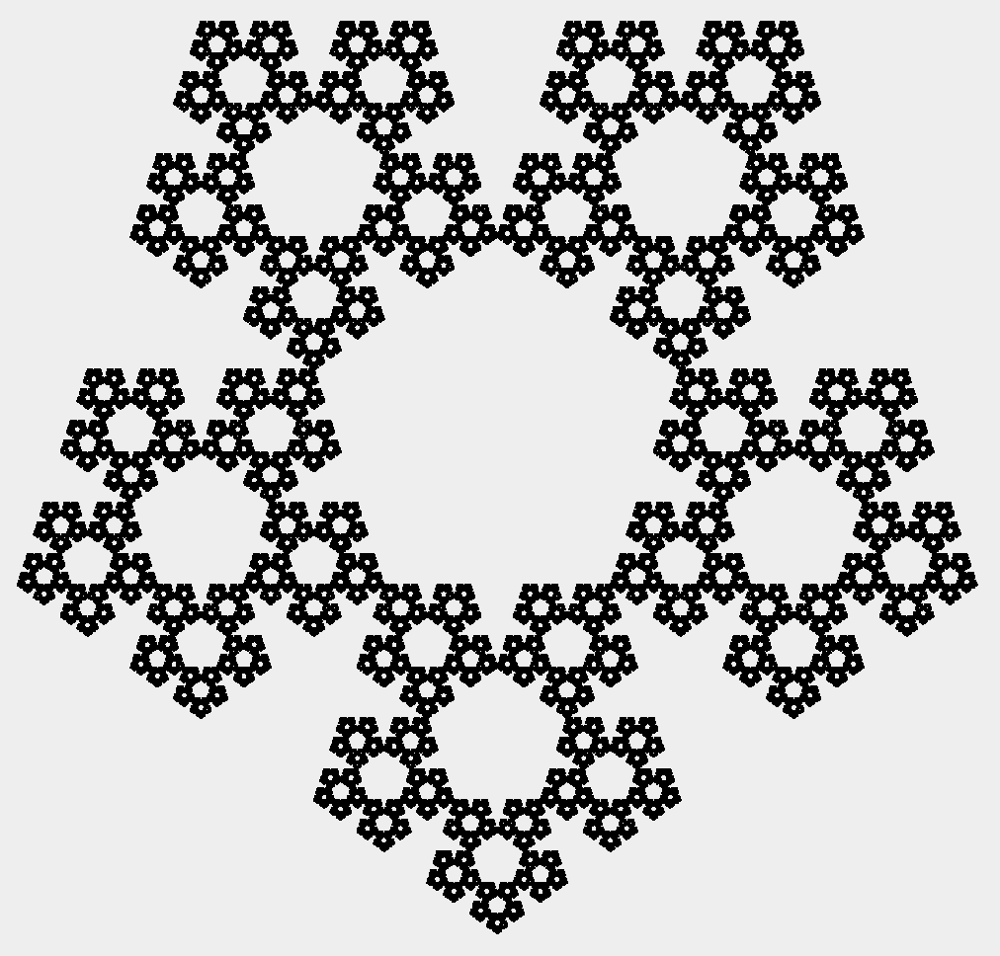
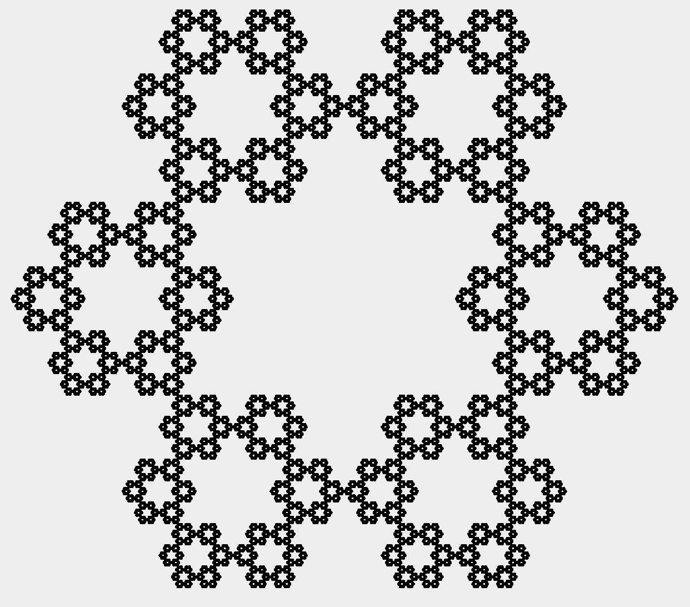
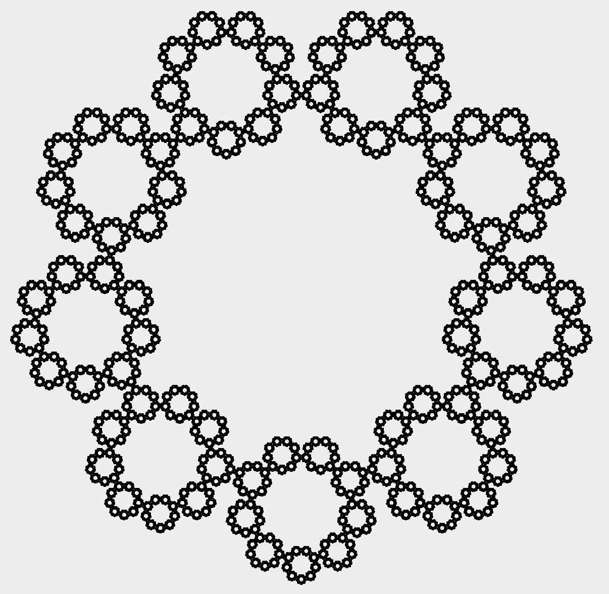
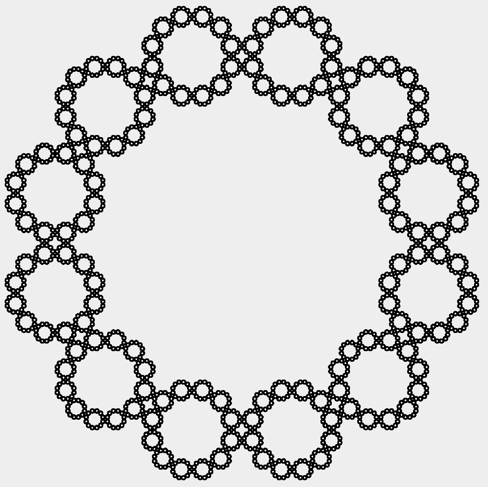
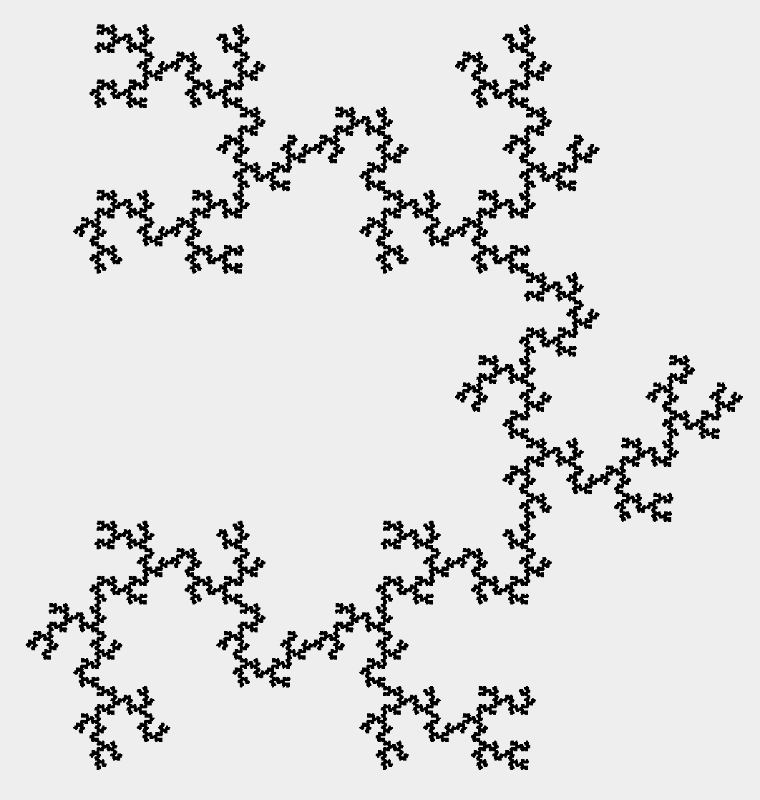
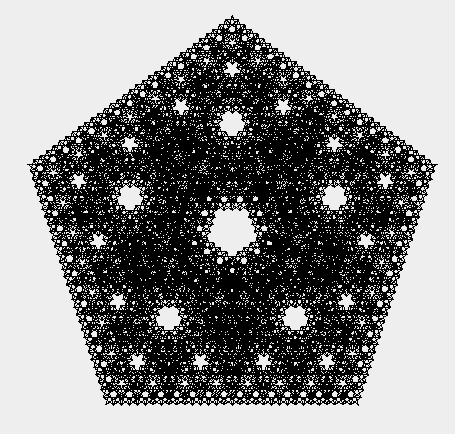
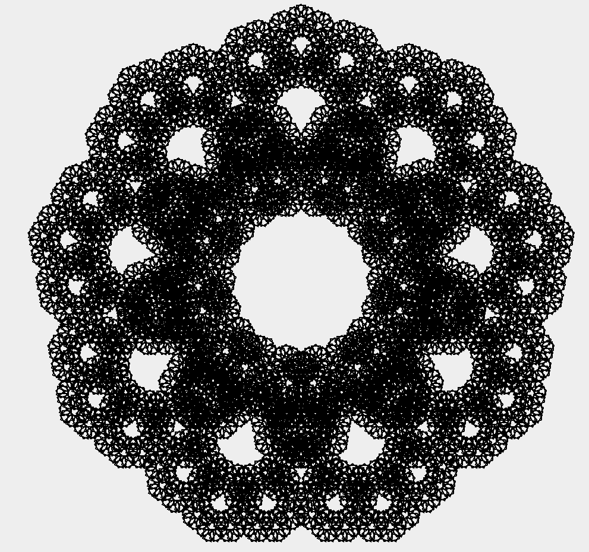

# Polygon

This program draws fractal polygons using recursion.

## Example output
These are the images of fractal polygons with different number of sides.

 Triangle (n=3)

 Pentagon (n=5)

 Hexagon (n=6)

 Heptagon (n=7)

 Nonagon (n=9) 

 Dodecagon (n=12)

## Extra output
These are the cool images I got when changing global variable CIRCLE_DEGREES (360 degrees) to different degrees.

 Pentagon (n=5), CIRCLE_DEGREES = 300

 Heptagon (n=7), CIRCLE_DEGREES = 300

 Pentagon (n=5), CIRCLE_DEGREES = 720

 Heptagon (n=7), CIRCLE_DEGREES = 720
