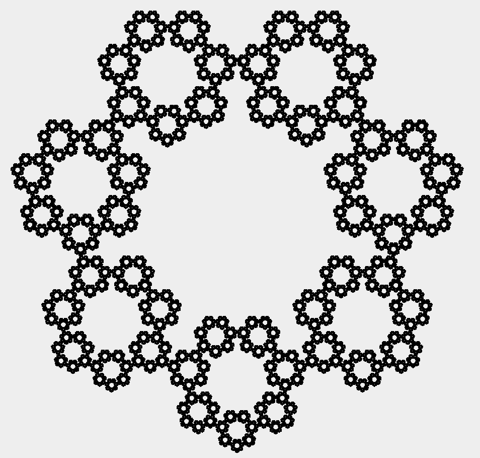
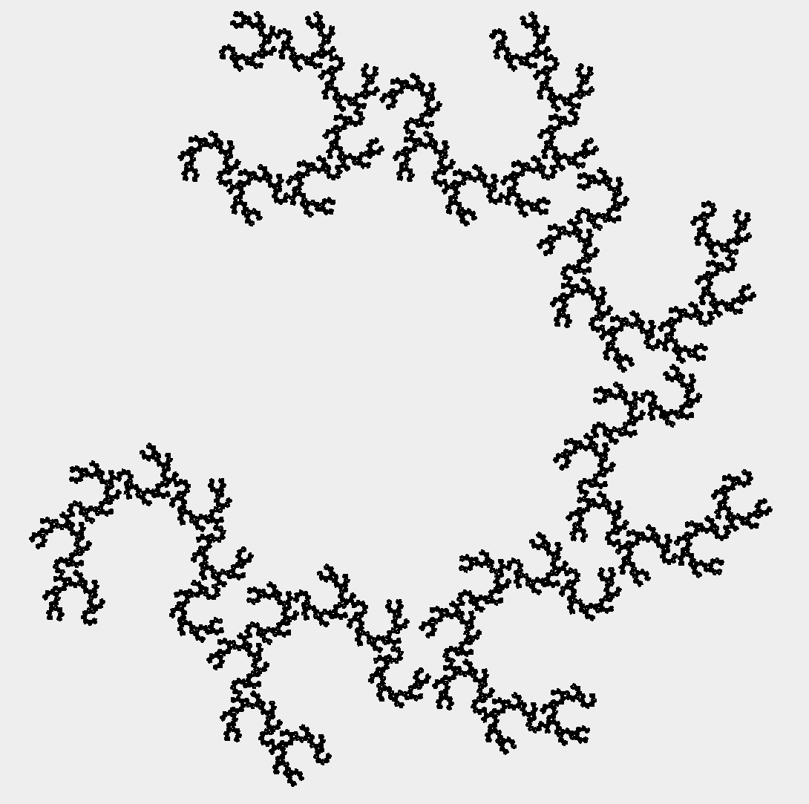

# Polygon

This program draws fractal polygons using recursion.

## Example output
These are the images of fractal polygons with different number of sides.

## Extra output
These are the cool images I got when changing CIRCLE_DEGREES to different degrees.

